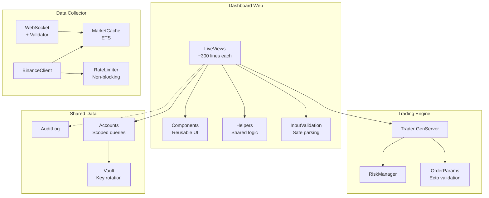

# Глобальный аудит безопасности, оптимизации и рефакторинга

**Дата:** 2026-01-10
**Проект:** Binance Trading System (Elixir/Phoenix)
**Уровень детализации:** A LOT (Comprehensive)

---

## Overview

Комплексный план улучшения торговой системы по трём направлениям:
1. **Безопасность** - устранение критических уязвимостей
2. **Оптимизация** - улучшение производительности без компромиссов
3. **Упрощение** - рефакторинг сложного кода

---

## Обнаруженные проблемы

### КРИТИЧЕСКИЕ (требуют немедленного исправления)

| # | Проблема | Файл | Риск |
|---|----------|------|------|
| 1 | `.env` с реальными ключами в репозитории | `/.env` | Полный компромат аккаунтов |
| 2 | Placeholder `signing_salt` в production | `endpoint.ex:7` | Слабая криптография сессий |
| 3 | Отсутствие user isolation | Все `*_live.ex` | Доступ к чужим данным |
| 4 | `String.to_atom()` от user input | `chains_live.ex:582` | Atom exhaustion DoS |

### ВЫСОКИЙ ПРИОРИТЕТ

| # | Проблема | Файл | Риск |
|---|----------|------|------|
| 5 | `same_site: "Lax"` вместо `"Strict"` | `endpoint.ex:8` | CSRF уязвимость |
| 6 | Нет валидации `String.to_integer()` | `chains_live.ex:184`, `orders_live.ex:97` | Crash LiveView |
| 7 | API keys в памяти GenServer | `trader.ex:110-111` | Утечка через memory dump |
| 8 | WebSocket сообщения без валидации | `binance_websocket.ex:115` | Corrupted data propagation |

### СРЕДНИЙ ПРИОРИТЕТ (Архитектура)

| # | Проблема | Файл | Влияние |
|---|----------|------|---------|
| 9 | LiveViews 1500+ строк | `strategies_live.ex`, `chains_live.ex` | Сложность поддержки |
| 10 | Дублирование `load_data()` | Все LiveViews | Inconsistency |
| 11 | Blocking `Process.sleep()` на rate limit | `binance_client.ex:46-49` | UI timeouts |
| 12 | Нет streams для списков | `orders_live.ex`, `chains_live.ex` | Memory bloat |

---

## Фаза 1: Критическая безопасность

**Цель:** Устранить уязвимости, позволяющие компрометацию системы

### 1.1 Удаление credentials из git history

```bash
# Создать .env.example без реальных значений
# Удалить .env из истории git (git filter-repo)
# Ротировать ВСЕ ключи: Binance API, DB passwords, SECRET_KEY_BASE, CLOAK_KEY
```

**Файлы:**
- `/.env` → удалить из git, добавить в `.gitignore`
- `/.env.example` → создать шаблон

### 1.2 Исправление session security

```elixir
# apps/dashboard_web/lib/dashboard_web/endpoint.ex
@session_options [
  store: :cookie,
  key: "_dashboard_web_key",
  signing_salt: System.get_env("SESSION_SIGNING_SALT"),  # Из env
  same_site: "Strict",  # Было "Lax"
  secure: true,         # Только HTTPS
  max_age: 86_400 * 7   # 7 дней
]
```

### 1.3 User isolation в LiveViews

```elixir
# Паттерн для всех LiveViews
defmodule DashboardWeb.OrdersLive do
  on_mount {DashboardWeb.UserAuth, :ensure_authenticated}

  def mount(_params, _session, socket) do
    user = socket.assigns.current_user
    account_id = get_user_account(user)

    socket =
      socket
      |> assign(:user_id, user.id)
      |> assign(:account_id, account_id)
      |> load_user_data()

    {:ok, socket}
  end
end
```

**Файлы для изменения:**
- `apps/dashboard_web/lib/dashboard_web/live/trading_live.ex:57`
- `apps/dashboard_web/lib/dashboard_web/live/settings_live.ex:18`
- `apps/dashboard_web/lib/dashboard_web/live/strategies_live.ex:26`
- `apps/dashboard_web/lib/dashboard_web/live/orders_live.ex`
- `apps/dashboard_web/lib/dashboard_web/live/chains_live.ex`
- `apps/dashboard_web/lib/dashboard_web/live/portfolio_live.ex`
- `apps/dashboard_web/lib/dashboard_web/live/history_live.ex`

### 1.4 Защита от Atom exhaustion

```elixir
# apps/dashboard_web/lib/dashboard_web/live/chains_live.ex

# БЫЛО (уязвимо):
String.to_atom(key)

# СТАЛО (безопасно):
@allowed_fields ~w(symbol side quantity price type)

defp safe_to_atom(key) when key in @allowed_fields do
  String.to_existing_atom(key)
rescue
  ArgumentError -> {:error, :invalid_field}
end
```

---

## Фаза 2: Input Validation

**Цель:** Предотвратить crashes от невалидного ввода

### 2.1 Безопасный парсинг integers

```elixir
# Создать shared helper модуль
defmodule DashboardWeb.InputValidation do
  @doc "Safely parse integer from user input"
  def parse_integer(value) when is_binary(value) do
    case Integer.parse(value) do
      {int, ""} when int >= 0 -> {:ok, int}
      _ -> {:error, :invalid_integer}
    end
  end
  def parse_integer(value) when is_integer(value), do: {:ok, value}
  def parse_integer(_), do: {:error, :invalid_integer}

  @doc "Safely parse decimal from user input"
  def parse_decimal(value) when is_binary(value) do
    case Decimal.parse(value) do
      {:ok, decimal} -> {:ok, decimal}
      :error -> {:error, :invalid_decimal}
    end
  end
end
```

**Применить в:**
- `chains_live.ex:131, 173, 184`
- `orders_live.ex:97`
- Все места с `String.to_integer()`

### 2.2 Валидация WebSocket сообщений

```elixir
# apps/data_collector/lib/data_collector/binance_websocket.ex

defmodule DataCollector.BinanceWebSocket.MessageValidator do
  @execution_report_fields ~w(e E s c S o f q p P F g C x X i l z L n N T t I w M O Z Y Q W V)

  def validate_execution_report(data) when is_map(data) do
    required = ~w(e s S o q)
    if Enum.all?(required, &Map.has_key?(data, &1)) do
      {:ok, data}
    else
      {:error, :missing_fields}
    end
  end
end

# В handle_message:
defp handle_message(%{"e" => "executionReport"} = data, state) do
  case MessageValidator.validate_execution_report(data) do
    {:ok, validated} ->
      Phoenix.PubSub.broadcast(BinanceSystem.PubSub, "order_updates", {:execution_report, validated})
    {:error, reason} ->
      Logger.warning("Invalid execution report: #{inspect(reason)}")
  end
  {:noreply, state}
end
```

---

## Фаза 3: Оптимизация производительности

**Цель:** Улучшить отзывчивость без компромиссов безопасности

### 3.1 LiveView Streams для списков

```elixir
# apps/dashboard_web/lib/dashboard_web/live/orders_live.ex

def mount(_params, _session, socket) do
  socket =
    socket
    |> stream(:orders, [], dom_id: &"order-#{&1["orderId"]}")
    |> assign(:orders_count, 0)

  send(self(), :load_orders)
  {:ok, socket}
end

def handle_info(:load_orders, socket) do
  orders = load_orders_from_api(socket.assigns.account_id)
  {:noreply, stream(socket, :orders, orders, reset: true)}
end

def handle_info({:order_update, order}, socket) do
  {:noreply, stream_insert(socket, :orders, order, at: 0)}
end

# В template:
# <tbody id="orders" phx-update="stream">
#   <tr :for={{dom_id, order} <- @streams.orders} id={dom_id}>
```

**Применить в:**
- `orders_live.ex` - список ордеров
- `chains_live.ex` - список chains
- `history_live.ex` - история trades
- `strategies_live.ex` - список стратегий

### 3.2 ETS кэширование market data

```elixir
# apps/data_collector/lib/data_collector/market_cache.ex

defmodule DataCollector.MarketCache do
  use GenServer

  @table :market_data
  @ticker_ttl 5_000  # 5 seconds

  def start_link(_), do: GenServer.start_link(__MODULE__, [], name: __MODULE__)

  def init(_) do
    :ets.new(@table, [:named_table, :set, :public, read_concurrency: true])
    {:ok, %{}}
  end

  def get_price(symbol) do
    case :ets.lookup(@table, {:price, symbol}) do
      [{_, price, ts}] when ts + @ticker_ttl > System.monotonic_time(:millisecond) ->
        {:ok, price}
      _ ->
        :stale
    end
  end

  def put_price(symbol, price) do
    :ets.insert(@table, {{:price, symbol}, price, System.monotonic_time(:millisecond)})
  end
end
```

### 3.3 Non-blocking rate limiting

```elixir
# apps/data_collector/lib/data_collector/binance_client.ex

# БЫЛО (блокирует):
{:wait, ms} ->
  Process.sleep(ms)
  get_account(api_key, secret_key)

# СТАЛО (возвращает ошибку):
{:wait, ms} ->
  {:error, {:rate_limited, ms}}

# Caller решает что делать:
case BinanceClient.get_account(api_key, secret_key) do
  {:ok, account} -> handle_success(account)
  {:error, {:rate_limited, ms}} ->
    Process.send_after(self(), :retry_get_account, ms)
    {:noreply, assign(socket, loading: true)}
end
```

### 3.4 Async data loading в LiveViews

```elixir
# Использовать assign_async для загрузки данных
def mount(_params, _session, socket) do
  {:ok,
   socket
   |> assign(:page_title, "Orders")
   |> assign_async(:orders, fn -> fetch_orders() end)
   |> assign_async(:symbols, fn -> fetch_symbols() end)}
end
```

---

## Фаза 4: Рефакторинг и упрощение

**Цель:** Уменьшить сложность без потери функциональности

### 4.1 Разделение больших LiveViews

```
strategies_live.ex (1501 строка) →
├── strategies_live.ex (основной, ~300 строк)
├── components/strategy_form.ex (~200 строк)
├── components/strategy_card.ex (~150 строк)
├── components/strategy_list.ex (~100 строк)
└── strategies_live/actions.ex (бизнес-логика, ~400 строк)
```

### 4.2 Shared LiveView helpers

```elixir
# apps/dashboard_web/lib/dashboard_web/live/helpers/data_loader.ex

defmodule DashboardWeb.Live.DataLoader do
  @moduledoc "Shared data loading functions for LiveViews"

  def load_account(socket) do
    account_id = socket.assigns.account_id
    case SharedData.Accounts.get_account(account_id) do
      {:ok, account} -> {:ok, assign(socket, :account, account)}
      {:error, _} -> {:error, :account_not_found}
    end
  end

  def load_symbols(socket) do
    symbols = DataCollector.BinanceClient.get_trading_symbols()
    assign(socket, :available_symbols, symbols)
  end

  def subscribe_to_market(socket, symbol) do
    SharedData.PubSub.subscribe("market:#{symbol}")
    socket
  end
end
```

### 4.3 Использование Ecto embedded schemas для валидации

```elixir
# apps/trading_engine/lib/trading_engine/order_params.ex

defmodule TradingEngine.OrderParams do
  use Ecto.Schema
  import Ecto.Changeset

  @primary_key false
  embedded_schema do
    field :symbol, :string
    field :side, Ecto.Enum, values: [:BUY, :SELL]
    field :type, Ecto.Enum, values: [:LIMIT, :MARKET, :STOP_LOSS_LIMIT]
    field :quantity, :decimal
    field :price, :decimal
    field :time_in_force, Ecto.Enum, values: [:GTC, :IOC, :FOK], default: :GTC
  end

  def changeset(params) do
    %__MODULE__{}
    |> cast(params, [:symbol, :side, :type, :quantity, :price, :time_in_force])
    |> validate_required([:symbol, :side, :type, :quantity])
    |> validate_number(:quantity, greater_than: 0)
    |> validate_price_for_limit()
  end

  defp validate_price_for_limit(changeset) do
    if get_field(changeset, :type) == :LIMIT do
      changeset
      |> validate_required([:price])
      |> validate_number(:price, greater_than: 0)
    else
      changeset
    end
  end
end
```

---

## Фаза 5: Дополнительная безопасность

### 5.1 Rate limiting на LiveView events

```elixir
# apps/dashboard_web/lib/dashboard_web/plugs/rate_limiter.ex

defmodule DashboardWeb.RateLimiter do
  @moduledoc "Rate limit LiveView events per user"

  @events_per_minute 60

  def check_rate(user_id, event_name) do
    key = "rate:#{user_id}:#{event_name}"

    case Cachex.incr(:rate_limits, key, 1, ttl: 60_000) do
      {:ok, count} when count <= @events_per_minute -> :ok
      {:ok, _} -> {:error, :rate_limited}
    end
  end
end

# В LiveView:
def handle_event("place_order", params, socket) do
  case RateLimiter.check_rate(socket.assigns.user_id, "place_order") do
    :ok -> do_place_order(params, socket)
    {:error, :rate_limited} ->
      {:noreply, put_flash(socket, :error, "Too many requests")}
  end
end
```

### 5.2 Audit logging для sensitive operations

```elixir
# apps/shared_data/lib/shared_data/audit_log.ex

defmodule SharedData.AuditLog do
  def log_action(user_id, action, details) do
    %{
      user_id: user_id,
      action: action,
      details: details,
      ip_address: get_ip(),
      timestamp: DateTime.utc_now()
    }
    |> SharedData.AuditEntry.changeset()
    |> SharedData.Repo.insert()
  end
end

# Использование:
AuditLog.log_action(user_id, :api_key_viewed, %{account_id: account_id})
AuditLog.log_action(user_id, :order_placed, %{symbol: symbol, side: side, quantity: qty})
```

### 5.3 Sudo mode для sensitive operations

```elixir
# Требовать повторную аутентификацию для:
# - Просмотр API ключей
# - Изменение trading settings
# - Удаление аккаунтов

# В router.ex
live_session :sudo_required,
  on_mount: [
    {PhoenixKitWeb.Users.Auth, :require_sudo_mode}
  ] do
  live "/app/accounts/:id/api-keys", ApiKeysLive
end
```

---

## Acceptance Criteria

### Функциональные требования

- [ ] Все API ключи ротированы, .env удалён из git history
- [ ] Session security: signing_salt из env, same_site: Strict
- [ ] User isolation работает во всех LiveViews
- [ ] Нет crashes от invalid input
- [ ] WebSocket сообщения валидируются

### Нефункциональные требования

- [ ] LiveView memory usage снижен (streams вместо assigns)
- [ ] Rate limiting не превышает 60 events/min на юзера
- [ ] Нет blocking operations в LiveView handlers
- [ ] Audit log для всех sensitive operations

### Quality Gates

- [ ] `mix sobelow` - 0 high severity issues
- [ ] `mix credo --strict` - passes
- [ ] `mix test` - all pass
- [ ] Manual security review completed

---

## Диаграмма архитектуры (после рефакторинга)



---

## Приоритеты реализации

| Фаза | Описание | Приоритет | Сложность |
|------|----------|-----------|-----------|
| 1 | Критическая безопасность | CRITICAL | Medium |
| 2 | Input Validation | HIGH | Low |
| 3 | Оптимизация | MEDIUM | Medium |
| 4 | Рефакторинг | MEDIUM | High |
| 5 | Дополнительная безопасность | LOW | Medium |

---

## References

### Internal
- `apps/dashboard_web/lib/dashboard_web/endpoint.ex` - session config
- `apps/dashboard_web/lib/dashboard_web/live/chains_live.ex:582` - atom vulnerability
- `apps/data_collector/lib/data_collector/binance_client.ex:46-49` - blocking rate limit
- `apps/trading_engine/lib/trading_engine/trader.ex:110-111` - credentials in state

### External
- [Phoenix 1.8 Security](https://www.phoenixframework.org/blog/phoenix-1-8-released)
- [LiveView Streams](https://fly.io/phoenix-files/phoenix-dev-blog-streams/)
- [Binance API Security](https://developers.binance.com/docs/binance-spot-api-docs/websocket-api/request-security)
- [Cloak Key Rotation](https://hexdocs.pm/cloak_ecto/rotate_keys.html)
- [Phoenix Security Docs](https://hexdocs.pm/phoenix/security.html)
